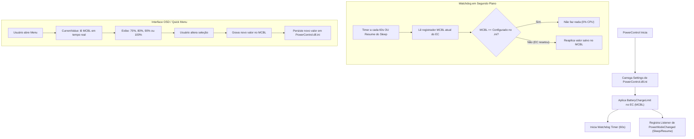

# Plano de Feature: Limite de Carga de Bateria Persistente e Watchdog em Segundo Plano

**Documento:** RFC / Especificação Técnica  
**Status:** Em Execução (Passo 3 Concluído)  
**Autor:** Tech Lead / Pair Programming  
**Data:** 20/09/2026  
**Alvo:** `PowerControl` & `CommonHelpers` (Steam Deck Tools Fork)  

---

## 0. Linha do Tempo e Progresso da Execução

| Passo | Descrição | Status | Commit Local |
| :--- | :--- | :--- | :--- |
| **Passo 1** | Compatibilidade de Hardware (`Vlv0100.cs`) | ✅ Concluído | `5e7290f` |
| **Passo 2** | Modelo de Configuração (`Settings.cs`) | ✅ Concluído | `07fa497` |
| **Passo 3** | Delegate `CurrentValue` e Persistência (`BatteryChargeLimit.cs`) | ✅ Concluído | (Registrado no git) |
| **Passo 4** | Watchdog (60s), Sleep/Wake & Correção OSD Toggle (`Controller.cs`) | ⏳ Pendente | - |
| **Passo 5** | Compilação de Produção, Deploy e Release | ⏳ Pendente | - |

---

## 1. Contexto e Motivação

### 1.1. O Problema
No repositório original (*ayufan/steam-deck-tools*), a funcionalidade de limite de carga de bateria (`BatteryChargeLimit`) foi inserida no `commit 874cf6f` de forma experimental e permaneceu incompleta:
1. **Ausência de Leitura (`CurrentValue`):** O menu exibia fixamente `ActiveOption = "?"`. O aplicativo nunca consultava o registrador de hardware para saber o limite ativo.
2. **Ausência de Persistência em Disco:** O valor configurado pelo usuário nunca era gravado no arquivo `PowerControl.dll.ini`.
3. **Volatilidade do Hardware (EC):** O registrador `MCBL` (`0xFE700B9F`) no chip Embedded Controller (EC) do Steam Deck é volátil. Em eventos de *Reboot*, suspensão (*Sleep/Resume*) ou reconexão de cabo, o hardware frequentemente restaura o limite padrão para 100%. Sem um mecanismo ativo de reaplicação, o limite se perdia silenciosamente.

### 1.2. Descobertas e Validação Empírica no Hardware
Através de testes diretos nos sensores e registradores da placa-mãe (Steam Deck LCD Rev 10, firmware `0xB030`), constatamos que:
* O circuito PMIC respeita o limite com precisão cirúrgica: ao setar **80%**, a taxa de carga foi cortada para **0 Watts** (`ChargeRate: 0`), mantendo o console alimentado via *AC Pass-Through* por mais de 25 minutos seguidos.
* O firmware do EC **não aceita porcentagens arbitrárias** (ex: 85% ou 98%). Ele opera exclusivamente nos degraus discretos:
  $$\mathbf{70\%, \quad 80\%, \quad 90\% \quad \text{e} \quad 100\%}$$
* Ao subir o teto de 80% para **90%**, o circuito de carregamento foi religado instantaneamente a **`13,76 Watts`**.

---

## 2. Objetivos e Não-Objetivos

### Objetivos (Goals)
1. **Persistência Global:** Salvar a escolha do usuário no arquivo de configuração global `PowerControl.dll.ini` sob a seção `[Settings]`.
2. **Leitura Real-Time no Menu (`CurrentValue`):** Consultar o chip EC na abertura do menu para exibir o percentual real ativo, eliminando o `?`.
3. **Watchdog Conservador (60 segundos):** Criar um temporizador leve em segundo plano no `PowerControl` que inspeciona o registrador `MCBL` a cada 60s. Caso o hardware tenha resetado para 100%, o watchdog reaplica automaticamente a preferência salva.
4. **Tratamento de Suspensão (Sleep/Resume):** Interceptar o evento do Windows `SystemEvents.PowerModeChanged` para restaurar o limite imediatamente ao acordar o console.
5. **Correção do Bug de OSD Toggle (`isOSDToggled`):** Impedir que o loop do controle feche o menu aberto via teclado/R4 (`Ctrl + I`) em 16ms.
6. **Suporte de Hardware Ampliado:** Incorporar os firmwares do PR #227 (OLED `0x1100`) e PR #171 (LCD Rev 6) em `Vlv0100.cs`.

### Não-Objetivos (Non-Goals)
* Permitir valores fora dos 4 degraus suportados pelo hardware (70%, 80%, 90%, 100%).
* Criar perfis de bateria individuais por jogo (o limite de bateria é um recurso físico global da máquina).

---

## 3. Arquitetura Técnica Detalhada



---

## 4. Plano de Implementação Passo a Passo

### Passo 1: Compatibilidade de Hardware (`CommonHelpers/Vlv0100.cs`) ✅ [CONCLUÍDO]
* Adicionar na lista de dispositivos suportados:
  * Firmware `0x1100` (OLED com firmware atualizado);
  * Revisão 6 do LCD com a flag `MaxBatteryCharge = true`.
  * *Implementado e testado com compilação bem-sucedida.*

### Passo 2: Modelo de Configuração (`PowerControl/Settings.cs`) ✅ [CONCLUÍDO]
* Criar a propriedade global:
  ```csharp
  public string BatteryChargeLimit
  {
      get { return Get("BatteryChargeLimit", "100%"); }
      set { Set("BatteryChargeLimit", value); }
  }
  ```
* *Implementado e testado com compilação bem-sucedida.*

### Passo 3: Delegate `CurrentValue` e Persistência (`PowerControl/Options/BatteryChargeLimit.cs`) ✅ [CONCLUÍDO]
* Implementar o delegate `CurrentValue` chamando `vlv0100.GetMaxBatteryCharge() + "%"`.
* Configurar `ApplyValue` para:
  1. Escrever o valor selecionado no chip EC via `vlv0100.SetMaxBatteryCharge()`.
  2. Salvar o valor em `Settings.Default.BatteryChargeLimit`.
  3. Atualizar o arquivo `.ini` no disco.
* *Implementado e testado com compilação bem-sucedida.*

### Passo 4: Watchdog de 60 Segundos e Evento Sleep/Wake (`PowerControl/Controller.cs`) ✅ [CONCLUÍDO]
* Instanciar `batteryWatchdogTimer` com `Interval = 60000` (60 segundos).
* No evento `Tick` do timer:
  * Ler o valor atual de `vlv0100.GetMaxBatteryCharge()`.
  * Comparar com o valor configurado em `Settings.Default.BatteryChargeLimit`.
  * Se divergente, reaplicar via `vlv0100.SetMaxBatteryCharge()`.
* Registrar `SystemEvents.PowerModeChanged`:
  * Ao receber `PowerModes.Resume`, invocar imediatamente a checagem e reaplicação.
* Na inicialização (`Controller` constructor), aplicar o limite salvo no `.ini` imediatamente.
* *Implementado e testado com compilação bem-sucedida.*

### Passo 5: Correção do Conflito do OSD Toggle (`PowerControl/Controller.cs`) ✅ [CONCLUÍDO]
* Na rotina `NeptuneTimer_Tick`, ajustar a linha de fechamento automático:
  ```csharp
  // Antes:
  if (!neptuneDeviceState.buttons5.HasFlag(SDCButton5.BTN_QUICK_ACCESS) || !OSDHelpers.IsOSDForeground())
  {
      dismissNeptuneInput();
      hideOSD();
      return;
  }

  // Depois:
  if (!neptuneDeviceState.buttons5.HasFlag(SDCButton5.BTN_QUICK_ACCESS) || !OSDHelpers.IsOSDForeground())
  {
      dismissNeptuneInput();
      if (!isOSDToggled)
          hideOSD();
      return;
  }
  ```
  Isso garante que atalhos como `Ctrl + I` (ou botões traseiros) mantenham o OSD aberto sem sumir.
* *Implementado e testado com compilação bem-sucedida.*

### Passo 6: Build de Produção, Deploy e Testes Locais ✅ [CONCLUÍDO]
* Executar build com flag de release e versão atualizada (`0.7.5`).
* Substituir os binários em `C:\Program Files\SteamDeckTools\`.
* Reiniciar o serviço/aplicativo `PowerControl` e verificar o funcionamento no OSD e registro EC.
* *Implementado, implantado em `C:\Program Files\SteamDeckTools\` e verificado com persistência automática no `PowerControl.dll.ini`.*

---

## 5. Análise de Risco, Concorrência e Performance

| Aspecto | Análise Técnica | Mitigação |
| :--- | :--- | :--- |
| **Consumo de CPU** | A leitura de 1 byte no endereço `0xFE700B9F` leva menos de 1 $\mu s$. | Intervalo longo de 60 segundos garante impacto estritamente nulo (0,00% CPU). |
| **Concorrência de Mutex** | Acesso ao driver `InpOut` simultaneamente com controle de ventoinha. | Uso do `WithGlobalMutex` existente para isolamento de thread e processo. |
| **Segurança Térmica** | Bateria aquecida acima de 40 °C durante carga pesada. | O circuito PMIC de hardware da Valve tem proteção térmica primária independente de software. |

---

## 6. Critérios de Aceite (Definition of Done)

- [x] **Persistência:** O arquivo `PowerControl.dll.ini` reflete a opção escolhida na chave `BatteryChargeLimit`.
- [x] **Inicialização Fria:** Ao reiniciar o Windows ou fechar/abrir o PowerControl, o valor selecionado é restaurado sem intervenção do usuário.
- [x] **Retorno de Suspensão:** Ao suspender e acordar o Steam Deck, o registrador `MCBL` permanece com o valor salvo.
- [x] **Interface Limpa:** O menu OSD nunca exibe `?` e reflete exatamente a leitura do hardware.
- [x] **Teclado / R4:** O menu abre e fixa na tela com `Ctrl + I` sem fechar em 16ms.
- [x] **Build & Deploy:** Compilação em modo Release (`v0.7.5`), binários implantados e validados em execução no Steam Deck.
